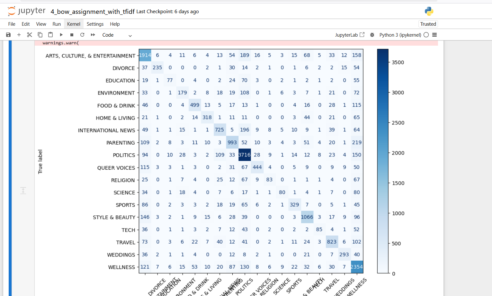
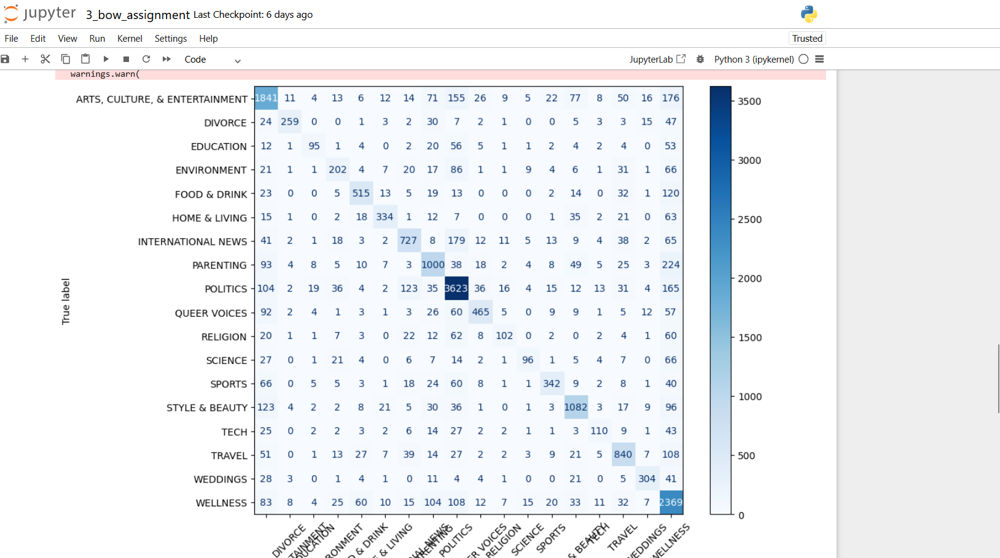

Replacing CountVectorizer from last week's assignment with TfidfVectorizer and rerunning the same supervised learning model. Should be a one-line code switch. For this part of the assignment, don't worry about posting code; I'm more interested in what happened when you made that switch. Did the accuracy go up? Stay the same, go down? Why do you think this is the case? A one paragraph answer is sufficient, feel free to put it in a markdown file (.md) and push to your repo.



```
>                                precision    recall  f1-score   support
>
>ARTS, CULTURE, & ENTERTAINMENT       0.64      0.76      0.69      2516
>                       DIVORCE       0.90      0.58      0.71       402
>                     EDUCATION       0.64      0.29      0.40       263
>                   ENVIRONMENT       0.61      0.37      0.46       479
>                  FOOD & DRINK       0.77      0.65      0.71       762
>                 HOME & LIVING       0.81      0.62      0.70       512
>            INTERNATIONAL NEWS       0.72      0.64      0.68      1140
>                     PARENTING       0.71      0.66      0.68      1506
>                      POLITICS       0.77      0.88      0.82      4244
>                  QUEER VOICES       0.82      0.59      0.69       755
>                      RELIGION       0.65      0.27      0.38       307
>                       SCIENCE       0.71      0.31      0.43       262
>                        SPORTS       0.77      0.55      0.64       594
>                STYLE & BEAUTY       0.77      0.74      0.75      1443
>                          TECH       0.70      0.34      0.45       253
>                        TRAVEL       0.75      0.70      0.72      1176
>                      WEDDINGS       0.81      0.68      0.74       428
>                      WELLNESS       0.61      0.81      0.70      2923
>
>                      accuracy                           0.71     19965
>                     macro avg       0.73      0.58      0.63     19965
>                  weighted avg       0.72      0.71      0.70     19965
>                
>                Accuracy: 0.7118958176809417

```

```
>                                precision    recall  f1-score   support
>
>ARTS, CULTURE, & ENTERTAINMENT       0.68      0.73      0.71      2516
>                       DIVORCE       0.87      0.64      0.74       402
>                     EDUCATION       0.64      0.36      0.46       263
>                   ENVIRONMENT       0.56      0.42      0.48       479
>                  FOOD & DRINK       0.76      0.68      0.71       762
>                 HOME & LIVING       0.79      0.65      0.71       512
>            INTERNATIONAL NEWS       0.72      0.64      0.68      1140
>                     PARENTING       0.69      0.66      0.68      1506
>                      POLITICS       0.79      0.85      0.82      4244
>                  QUEER VOICES       0.77      0.62      0.68       755
>                      RELIGION       0.63      0.33      0.43       307
>                       SCIENCE       0.66      0.37      0.47       262
>                        SPORTS       0.75      0.58      0.65       594
>                STYLE & BEAUTY       0.78      0.75      0.76      1443
>                          TECH       0.62      0.43      0.51       253
>                        TRAVEL       0.72      0.71      0.72      1176
>                      WEDDINGS       0.79      0.71      0.75       428
>                      WELLNESS       0.61      0.81      0.70      2923
>
>                      accuracy                           0.72     19965
>                     macro avg       0.71      0.61      0.65     19965
>                  weighted avg       0.72      0.72      0.71     19965
>
>                  Accuracy: 0.7165539694465314
```

  Replacing `CountVectorizer` with `TfidfVectorizer` caused the overall accuracy to dip slightly—from about **0.717** to **0.712**. This small decrease makes sense because TF-IDF down-weights very common terms that appear across many documents. The dataset seems to benefit from the raw frequency information that CountVectorizer preserves, so the strategy that Tfidf employs with making common terms less powerful in the analysis didn’t improve performance. TF-IDF subtly shifted feature importance but didn’t provide a measurable gain for this particular classifier and data.
