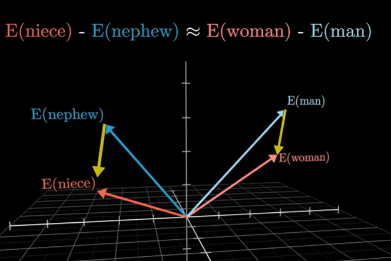

### Transformers Technical Blogpost Post

A transformer can be thought of as the magic behind an LLM like ChatGPT. The GPT in ChatGPT stands for Generative Pretrained Transformer. ChatGPT is essentially a master in predicting the next likely word to put in a sentence based on the context of the previous words in the input data. The neural network that makes up a transformer excels at sequence-to-sequence tasks by using a self-attention mechanism to weigh the importance of different parts of the input data. ChatGPT and other LLMs can be thought of following the pattern of predicting the next word, sampling a choice from a set of possible next words, and repeating.

#### Reading the data

The input text is first broken into tokens. Tokens are words, punctuation, and other characters that give text meaning. Each token is associated with a vector -namely a list of numbers- that encode the meaning of that token. This is called the **embedding** of the token, and is accomplished using an embedding matrix that connects every token with an embedding, and is made using large amounts of data. 

Consider the dot product, which allows us to see how similar two vectors are. If we think of the vectors associated with each of these tokens as existing in an n dimensional space, then it follows that you could use the dot product of two different vectors within that space associated with tokens to see how similar those two tokens were. Here is an illustration borrowed from 3Blue1Brown to demonstrate how the embeddings for the words niece and nephew are similarly far from the embeddings of the words woman and man, and how an embedding matrix is able to capture relationships in that way. In this case, how one word is the equivalent word in the opposite gender of the other.

#### Alright, what's attention?

**Attention** is how the transformer decides which words are important to pay attention to in order to discern meaning from a sentence.

An **Attention block** is a grouping of the vectors representing the encoding of the tokens in the senence. This grouping allows the vectors to exchange info and update their values as necessary to better account for context in a sentence. This results in a more accurate portrayal of each word given the words around it and ultimately better token prediction for the next likely word in the sentence. This is ultimately the goal of a transformer, to be able to predict the next word to display that makes sense for the given scenario. If each word is a token, and each token has an embedding (vector), then those embeddings influence each other in an attention block. For example the words lead, like the metal lead, and lead, like in leader, are spelled the same but mean completely different things. A human could use the context to figure out which word I meant when used in a sentence. A transformer, however, uses attention to adjust the embedding for lead to better match the correct word based on the other embeddings in the sentence.

#### Inside the attention head

An **attention head** refers to the process in which an attention block adjusts the values of each of the vectors inside it. Recall that each of these vectors is representing an embedding of a token, and thus changing the values in the vector will result in a different vector and a different token embedding entirely, and thus a different token representation.

To Summarize the process of adjusting these vectors, the process involves first a query matrix. This query matrix allows a question to be asked about a token that it can find the answer for by using the context of the vectors around it. For example, is lead referring to metal, or leadership? This query matrix is used in matrix multiplication, where it multiplies against the embedding for lead and produces a query vector associated with that query and embedding. Likewise, there is a key matrix with the answers to questions offered by the query vector. Multiplying the embedding and key matrix produces a key vector. Then by using the dot product of the query vector and key vector, we can see how similar those two vectors are, and thus, how well the answer from the key vector produced by the embedding of a _different_ token in the sentence matches the question offered from the first token and query pair. We can then consult a value matrix, which tells us exactly how much we need to adjust an embedding to get to the desired embedding of the same token but with context recieved from asking the question, and then using the information gained from a different token to find our meaning. In our example, how much do I need to adjust the embedding for the general term "lead" to definitively arrive at the metal lead?

This whole process is referred to as **self-attention**. It all occurs within the same attention head, and is how a relationship may be found for a word in context.

**Multi-headed attention** refers to repeating this same process, but in parallel across multiple attention heads. This allows the transformer to capture multiple kinds of relationships simultaneously. Each attention head has its own Query, Key, and Value matrices. This allows each head to pick up on different relationships based on what your query, key, and value matrices have, and results in a more robust model. The contextual questions and influences go beyond deciding between homographs. You could, for example, use the context of Xbox and Scorpions to deduce that when I refer to a Spartan, I'm talking about the one from Halo. Not a person from Sparta. There are many ways to contextually examine the meaning of a word, and different heads of attentions capture these meanings, and take those into consideration when deciding the next best token.

**Why is this such a good process for LLMs?**

Like I mentioned earlier, chatGPT and similar LLMs have the goal of taking in text, and then creating a response that takes into account all of the information that was provided to them. Their **Context Window**, which is the amount of tokens the model can take into consideration to predict the best response, is large, allowing them to have memory of past chats and weigh future responses in a way to produce the most meaningful response. By feeding the input through these blocks of embeddings and carefully adjusting the weights, the result is a neural network that is able to predict with astonishing accuracy what the most likely response is to a question that it is asked.
